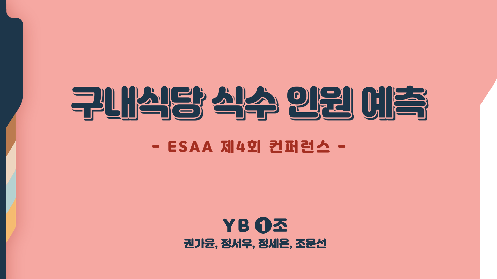

# 2021 DACON 구내식당 식수 인원 예측 AI 경진대회

### 1) 주제 : 구내식당의 요일별 점심, 저녁식사를 먹는 인원을 예측
- 주최 : 한국토지주택공사
- 주관 : 데이콘

### 2) [EDA](https://github.com/chom5621/2021-DACON/blob/1dcbf64ad2941ea1e2ca5a108bfe166269ceb686/EDA.ipynb)
- 일자 및 요일
- 본사정원수, 본사휴가자수, 본사출장자수, 본사시간외근무명령서승인건수, 현본사소속재택근무자수
- 조식메뉴, 중식메뉴, 석식메뉴
- 중식계, 석식계    

### 3) 전처리 및 모델링
- Feature Engineering (기본파생변수)
- 내부 데이터 활용 (석식메뉴 없는 날, 특식 있는 날, 중식계/석식계 랭크)
- 외부 데이터 활용 (공휴일 전후, 미세먼지, 기온, 강수적설량)
- 모델링 및 평가 (최종데이터 튜닝, Pycaret Regression)

### 4) 팀원
권가윤, 정서우, 정세은, 조문선

### 5) 발표자료
<https://chom5621.github.io/project/esaa/(2021-DACON)-%EA%B5%AC%EB%82%B4%EC%8B%9D%EB%8B%B9-%EC%8B%9D%EC%88%98-%EC%9D%B8%EC%9B%90-%EC%98%88%EC%B8%A1/>
